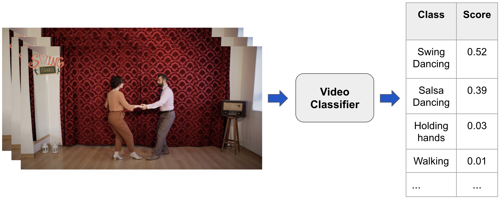

# Video Classification

This repository introduces Video Classification through a detailed exploration of a dataset and a pretrained model. Video Classification assigns a set of scores to a video clip, where scores typically correspond to action classes.



The primary contributions of this repository are

1. A Jupyter Notebook [video_classification.ipynb](video_classification.ipynb)
    - Demonstrating how to download, organize, explore and visualize the [Kinetics Human Action Video Dataset](https://deepmind.com/research/open-source/kinetics).
    - Demonstrating how to download from the [Tensorflow hub](https://www.tensorflow.org/hub) a pretrained [I3D video classification model](https://deepmind.com/research/open-source/i3d-model), and test it on small samples of the Kinetics dataset. 
    - Highlighting challenges and considerations of working with video data. 
2. A script [scripts/evaluate.py](scripts/evaluate.py) that allows the user to perform evaluation of I3D on larger samples, or full splits, of the Kinetics dataset.

The rest of this README file is organized as follows:
[Structure](##Structure) describes the repository's content and stucture.
[Required Resources](##Computational-Resources) describes the memory, processors, and storage requirements needed for execution.
[Installation](##Installation) describes how to install the necessary packages, modules, etc. — both when using [Cloudera Machine Learning](https://www.cloudera.com/products/machine-learning.html) platform (CML), and also when using your own resources, e.g., on your laptop.
[Execution](##Execution) explains how to run the code, both the Jupyter notebook and the evaluation script.
[References](##References) mentions relevant academic papers.

> Check out our blog [An Introduction to Video Understanding: Capabilities and Applications](https://blog.fastforwardlabs.com/2021/12/14/an-introduction-to-video-understanding-capabilities-and-applications.html) for a broad overview of the field to which video classification belongs.

-----------

## Structure

The folder structure of the repo is as follows:

```
.
├── cml             # Contains scripts that facilitate the project launch on CML.
├── data            # Location for storing video data. 
├── scripts         # Contains the evaluation script.
└── vidbench        # A small library of useful functions.
```
There is also an `images` directory which holds figures used in the Jupyter Notebook. 

Let's examine each of the important folders in turn.

### `cml`

These scripts facilitate the automated project setup on CML and are triggered by the declarative 
pipeline as defined in the `.project-metadata.yaml` file found in the project's root directory.

```
cml
├── install_dependencies.py
└── download_data.py
```

### `vidbench`

This is a small Python library to facilitate data downloading and processing, as well as model inference and evaluation. 

Its structure is as follows:
```
vidbench
├── data
│   ├── fetch.py     
│   ├── load.py
│   └── process.py
├── arguments.py
├── models.py
├── predict.py
├── visualize.py
└── utils.py
```

### `scripts`

The script contained here is used in conjunction with the `vidbench` library above and performs large-scale evaluation of a video classification model. 

```
scripts
├── config.txt
└── evaluate.py
```

### `data`

This AMP makes use of the [Kinetics Human Action Video Dataset](https://arxiv.org/abs/1705.06950), of which there are several versions. 
Documentation on these data sources can be found [here](https://github.com/cvdfoundation/kinetics-dataset/tree/ed85ec6b29aa569f0e4b21edbc1cd90818446ea4). 

If the project is launched on CML, a small selection of data will be pre-downloaded. If not, there are cues in the notebook to execute a data download. 


-----------

## Required Resources

Video data are rich and complex and, as such, require a considerable amount of storage and memory.

### Storage

The Kinetics video data used in this repo is only a fraction of what is available for model evaluation. Downloading the full, raw dataset would require 30-60 GiB (depending on whether you download the `validation` or `test` set). Our `KineticsLoader` class converts these raw videos to NumPy arrays and caches them for re-use. These cached, pre-processed video clips require even more storage -- up to a TB for the full validation set. We recommend starting with only a few hundred videos and assessing your storage capabilities before running a model evaluation on the full Kinetics `test` or `validation` sets. 

### Memory and processors

In addition to the storage requirements, processing these data through a pre-trained CNN model also requires considerable RAM. We recommend a minimum of 16 GiB which is enough to process a batch of 8 videos. Large batch sizes will require additional resources. 

In CML, we recommend at least 2 vCPU / 16 GiB Memory.


### GPUs

There is no GPU requirements. In fact, only CPU execution is currently supported. In the future, we look forward to upgrading this demo to utilize GPUs.

-----------

## Installation

The code and applications within were developed against Python 3.6.9, and are likely also to function with more recent versions of Python.

### Using CML

There are three ways to launch this project on CML:

1. **From Prototype Catalog** - Navigate to the Prototype Catalog on a CML workspace, select the "Video Classification" tile, click "Launch as Project", click "Configure Project"
2. **As ML Prototype** - In a CML workspace, click "New Project", add a Project Name, select "AMPs" as the Initial Setup option, copy in the repo URL, click "Create Project", click "Configure Project". The default configuration values will be taken from the `.project-metadata.yaml` file and don't need to be changed.
3. **Manual Setup** - In a CML workspace, click "New Project", add a Project Name, select "Git" as the Initial Setup option, copy in the repo URL, click "Create Project". Installation of requirements will be done as part of the execution of the Jupyter notebook [video_classification.ipynb](video_classification.ipynb).

### Not using CML

To install dependencies on your own system, first create and activate a new virtual environment through your preferred means, then pip install from the requirements file. We recommend:

```python
python -m venv .venv
source .venv/bin/activate
pip install -r requirements.txt
```

-----------


## Execution 

Here are instructions to run the Jupyter notebook and the evaluation script, both with and without the use of CML.

### Jupyter notebook

In CML, launch a JupyterLab Session with at least 16 GiB of memory and 2 vCPUs. Outside CML ensure you open the notebook on a system with similar resources. Then simply follow the notebook instructions.


### Evaluation script

Execution of the evaluation script, [scripts/evaluate.py](scripts/evaluate.py), requires the [scripts/config.txt](scripts/config.txt) file which handles all the input arguments. You can use the default values that come with the repository, or specify your own values, in the config file. The output of the execution will be placed in the folder `results`. Here are four different ways to execut the script:

#### CML Workbench Session

Run the following in an open Workbench Session of CML:

```console
> !python3 scripts/evaluate.py @scripts/config.txt
```

#### CML Jobs

Alternatively, on CML, this script can also be run automatically with the **Jobs** abstraction by first clicking on **Jobs**, then **New Job**, and then selecting `scripts/evaluate.py` under **Script**. Enter `@scripts/config.txt` under **Arguments** and ensure that the job is given at least 2 vCPU/16 GiB of resources. Then click **Create Job**. You can now run the job as often as you like or schedule the job at your convenience.

#### CML JupyterLab Session

If you already have an JupyterLab session open, you can choose to run the script in a Linux terminal of that session by executing the following command:

```console
> python3 scripts/evaluate.py @scripts/config.txt
```


#### When not using CML

Execution is then done by executing this command on a terminal of the open session, at the root of the repository:

```console
$ python3 scripts/evaluate.py @scripts/config.txt
```

-----------

## References

1. "[Quo Vadis, Action Recognition? A New Model and the Kinetics Dataset](https://arxiv.org/abs/1705.07750)" by Joao Carreira and Andrew Zisserman.

1. "[The Kinetics Human Action Video Dataset](https://arxiv.org/abs/1705.06950)" by Will Kay et al.
